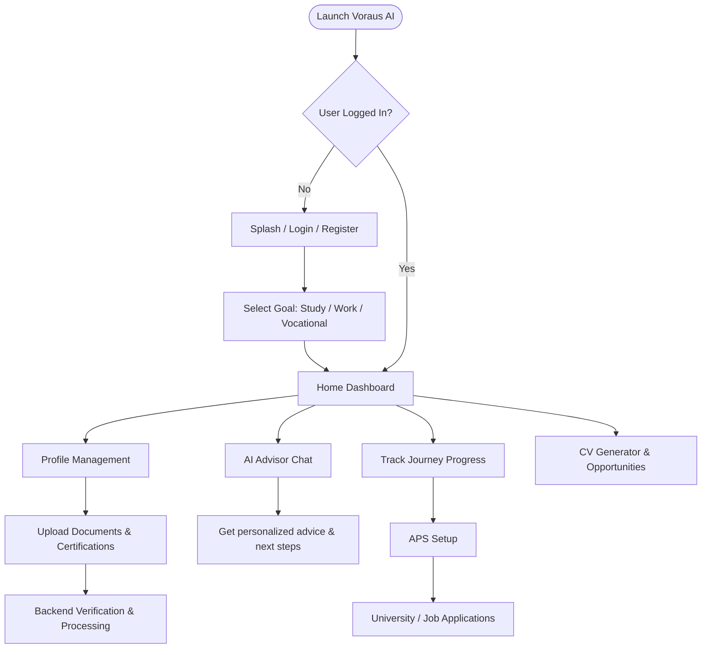

# Voraus AI 🚀

Voraus AI (formerly EduJourney Germany) is a comprehensive, AI-powered platform designed to streamline the applicant journey for individuals planning to study, pursue vocational training (Ausbildung), or work in Germany. 

Navigating German bureaucracy, university admissions, and visa processes can be overwhelming. Voraus AI acts as your personal digital consultant, managing your documents, tracking your progress, and providing AI-driven guidance every step of the way.

---

## ✨ Key Features

### 1. 📊 Interactive Dashboard & Journey Tracking
- A centralized hub to track your progress (e.g., "Profile 40% Completed").
- Step-by-step timeline of your journey: Document Uploads → Profile Verification → APS Setup → University/Job Applications.
- Actionable alerts for your immediate next steps (e.g., "Upload APS Certificate").

### 2. 🤖 AI Advisor
- Chat directly with a specialized AI trained on German immigration and education processes.
- Get personalized advice on required steps, opportunities, and documentation.
- Dynamic query resolution for complex bureaucracy questions.

### 3. 📂 Document & Qualification Verification
- Securely upload and manage critical documents: Degrees, CVs, Passports, and Language Certifications (IELTS/Goethe).
- Verification status tracking (Verified, Needs Review, Not Provided).
- Automated extraction and checking (via Backend).

### 4. 🎓 Opportunities & CV Generator
- Explore personalized university programs or job opportunities tailored to your profile.
- Built-in CV generator optimized for the German professional standard (Europass format integration).

---

## 🛠 Flowchart & Working of the Project

The application follows a structured, state-driven workflow ensuring users always know what to do next:



---

## 🏗 Tech Stack

The project is built as a full-stack application with a modern, scalable architecture.

### Frontend (Android)
- **Framework**: Jetpack Compose (Material 3 Design System)
- **Language**: Kotlin
- **Architecture**: MVVM (Model-View-ViewModel)
- **Navigation**: Jetpack Navigation Compose
- **Networking**: Retrofit & OkHttp

### Backend (API)
- **Framework**: NestJS (Node.js)
- **Language**: TypeScript
- **Database ORM**: Prisma
- **Architecture**: Modular Monolith
- **Testing**: Vitest

---

## 💻 Getting Started

### Prerequisites
- **Android Studio** (Koala or newer recommended)
- **Node.js** (v18+)
- **PostgreSQL** (or compatible database configured via Prisma)

### Running the Backend
1. Open a terminal and navigate to the backend directory:
   ```bash
   cd backend
   ```
2. Install dependencies:
   ```bash
   npm install
   ```
3. Set up your environment variables (`.env`) for Prisma and API keys.
4. Run database migrations:
   ```bash
   npx prisma migrate dev
   ```
5. Start the development server:
   ```bash
   npm run start:dev
   ```

### Running the Android App
1. Open the `android-app` directory in **Android Studio**.
2. Allow Gradle to sync and download all dependencies.
3. In `RetrofitClient.kt` or your config file, ensure the Base URL points to your running backend (e.g., `http://10.0.2.2:3000` for the emulator).
4. Build and Run the project on an Android Emulator or a physical device.

---

## 🎨 UI/UX Design Principles
- **Clean & Premium**: White/light background with a vibrant blue primary accent.
- **Dynamic & Floating**: Floating navigation bars and soft-shadow cards for a modern feel.
- **User-Centric**: Clear call-to-actions, warning highlights for missing documents, and distinct status badges.
