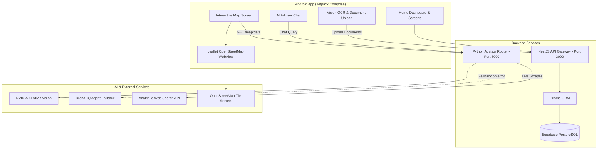

# Voraus AI 🚀
*(Formerly EduJourney Germany)*

**Voraus AI** is an end-to-end, AI-powered platform designed to empower international students, job-seekers, and vocational trainees (Ausbildung) navigating higher education, bureaucracy, and life in Germany. 

From automated Vision OCR document extraction and personalized university matching to real-time interactive mapping and dual-engine AI advisory, Voraus AI streamlines the complex German transition journey.

---

## 🌟 What's New & Key Highlights

### 1. 🗺️ Interactive Live Student & Opportunity Map
An interactive map built with **OpenStreetMap** and **Leaflet.js** embedded natively via Android WebViews:
- **40+ Curated, Authentic Berlin Locations**:
  - 🍛 **Indian Restaurants**: AMRIT Mitte, AMRIT Kreuzberg, Papadam, Mela Schöneberg, Khushi, Chutnify Neukölln, Saravanaa Bhavan, Shivani, Agra, Vedis (with ratings, addresses, and specialties).
  - 🎓 **Universities & Colleges**: TU Berlin, HU Berlin, FU Berlin, HTW Berlin, HWR Berlin, Charité, ESMT Berlin, SRH Berlin, IU International, BHT Berlin.
  - 💼 **English-Speaking Student Jobs (Werkstudent / Minijobs)**: Zalando SE Tech Hub, Delivery Hero HQ, N26 Mobile Bank, HelloFresh, Amazon Dev Center, Flink Mitte, Getir/Gorillas, Tier Mobility, SoundCloud, Babbel, Wayfair, Personio (with wage ranges, e.g., €14.50–€19.00/hr, role types, and shift flexibility).
  - 🤝 **Indian Communities & Student Welfare**: Indian Association Berlin (IAB), ISA TU Berlin, Indian Embassy & Tagore Centre, Friends of India, Telugu Association (TABB), Tamil Sangam Berlin, Gurudwara Sri Guru Singh Sabha (free Langar & emergency shelter), Sri Ganesha Temple.
- **Modern UI / UX Features**:
  - **Live Search**: Instant client-side search filtering by keyword, location, company, or specialty.
  - **Filter Chips with Live Count Badges**: Real-time filtering across `All (40)`, `💼 Jobs (12)`, `🍛 Restaurants (10)`, `🎓 Universities (10)`, `🤝 Communities (8)`.
  - **Floating Popup Cards**: Detailed cards showing category pills, exact Berlin address, hourly pay / Google rating, brief description, a native `View more →` handler, and direct `Directions ↗` opening Google Maps.
  - **Zero-Blank Offline Guarantee**: Bundled default dataset ensures the map loads instantly with all markings visible, even without an active internet connection.
  - **Bidirectional Jetpack Compose Sync**: Native Compose tabs immediately control the WebView map layer with zero latency.

### 2. ⚡ Python FastAPI Advisor Router & Anakin.io Integration (`advisor/`)
- **Real-Time Data Feeds**: Endpoint `GET /map/data` serving categorized opportunity data.
- **Live Anakin.io Web Extraction**: Integrated `POST /map/sync-anakin` using Anakin.io Search API for on-demand live web extraction of local German student opportunities.
- **Webhook Ingestion**: `POST /map/webhook` ready for external crawlers and data syndication.
- **Dual-Engine AI Advisor**:
  - Primary AI: **NVIDIA NIM / Mixtral** engine.
  - Automated Failover: Instant routing to **DronaHQ AI Agent** when Nvidia encounters unrecognized queries (`UNKNOWN_QUERY`) or upstream API rate limits.
  - Structured extraction of university recommendations using strict delimiter blocks (`[UNIVERSITY_RECOMMENDATIONS]...[/UNIVERSITY_RECOMMENDATIONS]`).

### 3. 📄 Vision OCR & Document Verification
- **NVIDIA Vision OCR Pipeline**: Extracts key passport fields (Full Name, Date of Birth, Passport Number, Nationality), academic degree titles, institutions, graduation years, and language proficiency levels.
- **Base64 Document Ingestion**: Secure mobile-to-backend upload flow feeding directly into user onboarding and profile storage (`UserProfileStore`).
- **Dynamic Status Tracking**: Tracks statuses across `Verified`, `Needs Review`, and `Pending`.

### 4. 🎯 University Matching & Opportunities Engine
- **Profile-Driven Recommendations**: Dynamically calculates admission match percentages based on user CGPA, German grade conversion (Bavarian Formula), and degree criteria.
- **Direct Application Portals**: One-tap buttons linking directly to official university application websites.
- **Application Tracker**: Live tracking of application stages (`Applied`, `Shortlisted`, `In Review`).

### 5. 💶 Finance & Visa Advisor
- Complete visa preparation module with blocked account requirements (€11,904 threshold), public/private health insurance comparisons (TK, Barmer, Expatrio, Coracle), and consulate checklists for Indian visa application centers (VFS/consulates).

### 6. 🎬 Video Splash Screen & Design Polish
- Immersive background video splash screen (`splash_bg_video.mp4`) with smooth navigation into authentication and onboarding flows.

---

## 🏗️ System Architecture



---

## 💻 Tech Stack

| Layer | Technology |
|---|---|
| **Android Mobile App** | Kotlin, Jetpack Compose, Material 3, Navigation Compose, Retrofit 2, OkHttp 3, Android WebView |
| **Mapping Engine** | Leaflet.js 1.9.4, Leaflet MarkerCluster, OpenStreetMap Tiles, Plus Jakarta Sans |
| **Python AI / Map Engine** | Python 3.12, FastAPI, Uvicorn, HTTPX, Pydantic, Dotenv |
| **Backend API** | NestJS, TypeScript, Prisma ORM, Node.js |
| **Database** | PostgreSQL hosted on Supabase |
| **AI & Automation** | NVIDIA NIM API, DronaHQ API, Anakin.io Search API |
| **Knowledge Base** | 45+ Curated CSV Datasets (Cost of Living, Visas, Course Matrices) |

---

## 📂 Project Structure

```
EduGerman/
├── advisor/                           # Python FastAPI AI Advisor & Map Backend
│   ├── advisor_router.py              # Main router: /map/data, /advisor/text, Anakin sync
│   ├── load_kb.py                     # Knowledge base loader
│   └── prompts/                       # Nvidia & DronaHQ system prompts
├── android-app/                       # Jetpack Compose Native Android App
│   ├── app/src/main/
│   │   ├── assets/
│   │   │   ├── leaflet_cluster_map.html   # OpenStreetMap interactive map & UI
│   │   │   ├── leaflet_heatmap.html       # Fallback heatmap layer
│   │   │   └── germany_csv/               # Bundled offline dataset files
│   │   ├── java/.../edujourneygermany/
│   │   │   ├── advisor/               # AiAdvisorScreen & AiAdvisorViewModel
│   │   │   ├── auth/                  # Onboarding, Login, Registration, Splash
│   │   │   ├── heatmap/               # HeatMapScreen (Compose WebView bridge)
│   │   │   ├── navigation/            # AppNavigation graph
│   │   │   ├── network/               # Retrofit ApiService & DTOs
│   │   │   ├── opportunities/         # University matching & application tracker
│   │   │   └── presentation/          # Dashboard & details screens
│   │   └── res/raw/                   # Video assets (splash_bg_video.mp4)
├── backend/                           # NestJS Backend API
│   ├── src/
│   │   ├── ai/                        # AI endpoints & chat controllers
│   │   ├── applicant/                 # Applicant profile management
│   │   ├── documents/                 # Document upload & OCR processing
│   │   ├── map/                       # Map module
│   │   └── opportunities/             # Opportunities search & recommendation
│   └── prisma/                        # Prisma schema & database migrations
└── datasets/                          # 45+ German Higher Education CSV Knowledge Bases
```

---

## 🚀 Getting Started

### 1. Prerequisites
- **Android Studio** (Koala or Ladybug recommended) with Android SDK 34+.
- **Python 3.10+** (with pip).
- **Node.js 18+** & npm.

---

### 2. Running the Python Advisor & Map Backend
1. Open a terminal and navigate to `advisor/`:
   ```bash
   cd advisor
   ```
2. Install Python dependencies:
   ```bash
   pip install fastapi uvicorn httpx pydantic python-dotenv
   ```
3. Start the FastAPI server on port 8000:
   ```bash
   python -m uvicorn advisor_router:app --reload --port 8000
   ```
   *The server is now live at `http://127.0.0.1:8000` with Swagger docs at `http://127.0.0.1:8000/docs`.*

---

### 3. Running the NestJS Backend
1. Navigate to `backend/`:
   ```bash
   cd backend
   ```
2. Install dependencies:
   ```bash
   npm install
   ```
3. Run Prisma migrations:
   ```bash
   npx prisma migrate dev
   ```
4. Start the server:
   ```bash
   npm run start:dev
   ```

---

### 4. Running the Android Application
1. Open the `android-app` directory in **Android Studio**.
2. Allow Gradle to sync and download dependencies.
3. Verify that your backend endpoints are accessible (use `10.0.2.2` for emulators or your machine's LAN IP for physical devices).
4. Connect your Android device or start an emulator.
5. Click **Run (▶)** in Android Studio.
6. Open the **Interactive Map** tab from the dashboard to explore Berlin's student ecosystem.

---

## 🔒 Security & Privacy
- **API Keys**: Stored securely via environment variables and BuildConfig.
- **Document Handling**: User uploads are handled in compliance with GDPR guidelines for educational guidance purposes.
