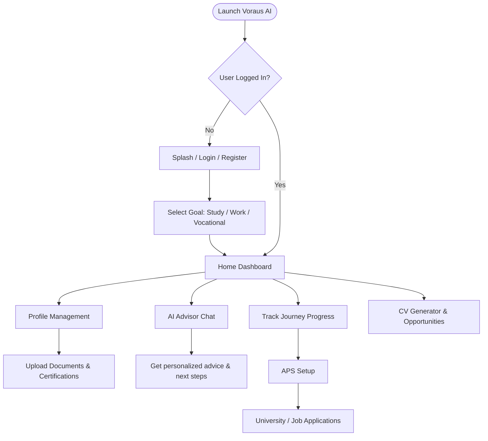

# Voraus AI

Voraus AI (formerly EduJourney Germany) is an AI-powered applicant journey platform for people planning to study, pursue vocational training, or work in Germany. It provides a sleek, professional, and minimal Android application to manage your documents, qualifications, applications, and interact with an AI Advisor.

## 📱 Features
- **Dashboard & Journey Tracking**: Keep track of your application progress to Germany (Documents, Verification, APS, University Application).
- **Profile Management**: Maintain verified professional and personal information.
- **AI Advisor**: Get guidance on required steps, opportunities, and documentation directly from an AI.
- **Documents & Qualifications Check**: Upload and verify your degree, CV, IELTS/German certifications, and more.

## 🛠 Flowchart & Working of the Project

The application follows a structured workflow where users progress through their journey steps:

## 🚀 Tech Stack
- **Android Framework**: Jetpack Compose (Material 3)
- **Language**: Kotlin
- **Architecture**: MVVM Navigation Architecture
- **Navigation**: Jetpack Navigation Compose

## 💻 Getting Started
1. Clone the repository.
2. Open `android-app` directory in **Android Studio**.
3. Build and Run the project on an emulator or physical device.
